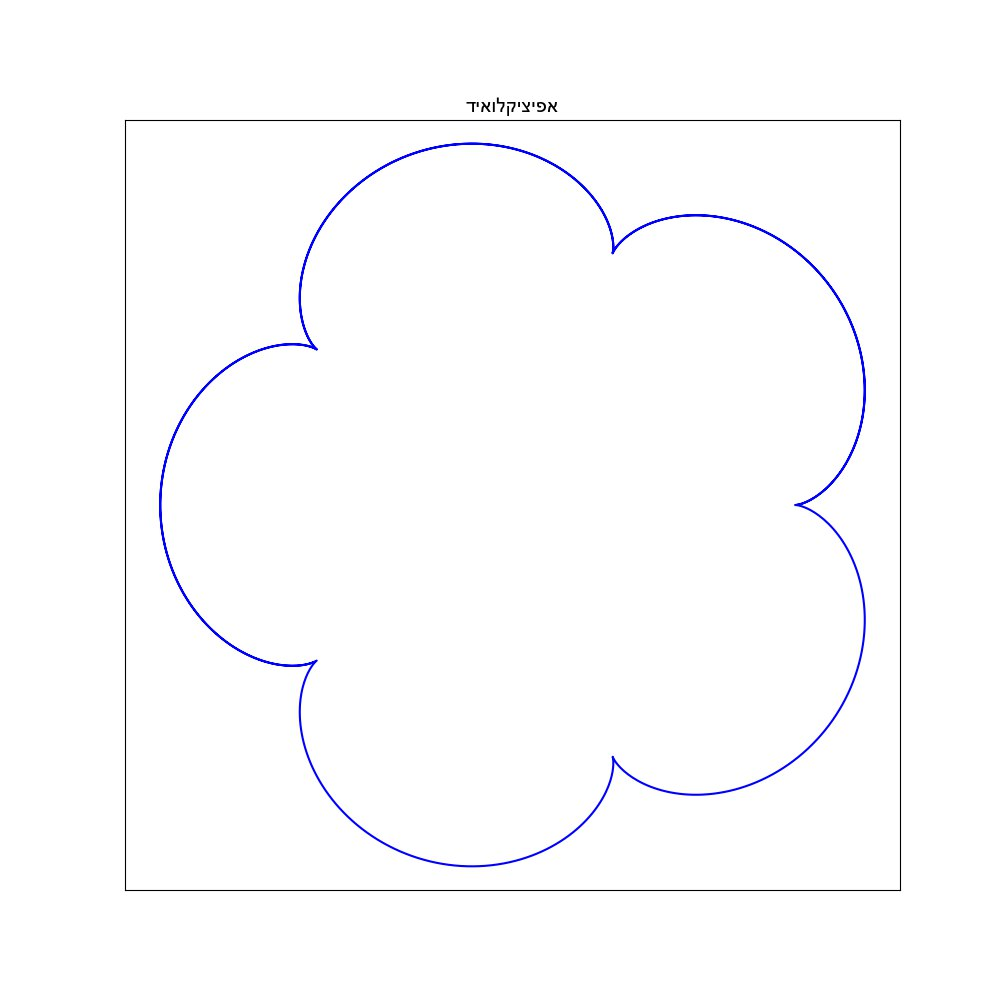
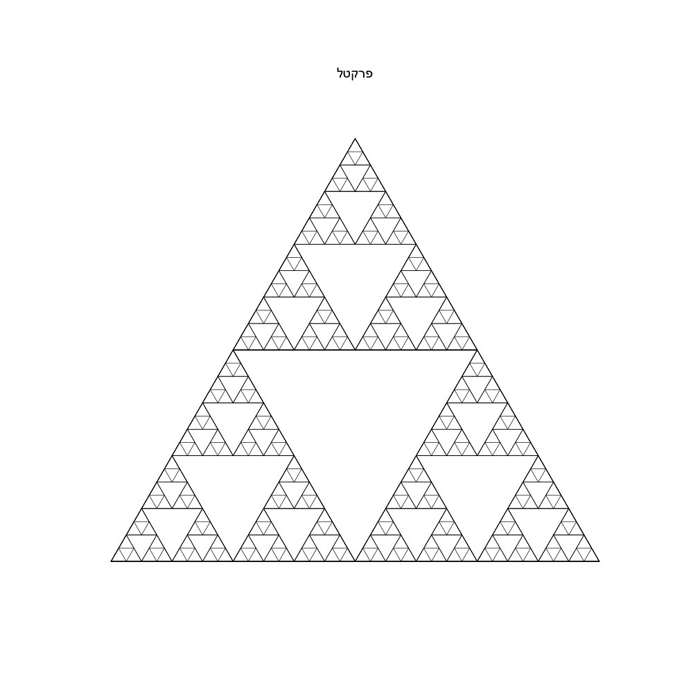

# 🎨 Mathematical Drawing Bot | בוט ציור מתמטי

[English](#english) | [עברית](#hebrew) | [Examples/דוגמאות](#examples)

---

<div dir="rtl">

## <a name="hebrew">🎯 סקירה כללית</a>

בוט טלגרם חכם שהופך תיאורים מילוליים לשרטוטים מתמטיים מדויקים! 🤖✏️

### 💫 יכולות
- יצירת שרטוטים מתמטיים מתיאור טקסטואלי בעברית
- תמיכה בצורות גיאומטריות (מעגלים, משולשים, מצולעים)
- שרטוט פונקציות וגרפים מתמטיים
- התאמה חכמה של סגנון התצוגה לפי סוג השרטוט
- טיפול אוטומטי בטקסט בעברית

### 🛠️ התקנה והפעלה

1. **הכנת הסביבה**
```bash
git clone https://github.com/pilpel1/mathematical_drawing.git
cd mathematical_drawing
python -m venv venv
venv\Scripts\activate  # ב-Windows
# או source venv/bin/activate  # ב-Linux/Mac
pip install -r requirements.txt
```

2. **הגדרת משתני סביבה**
העתק את הקובץ `.env.example` לקובץ חדש בשם `.env` ועדכן את הערכים בהתאם:
```env
TELEGRAM_TOKEN=your_telegram_token
GEMINI_API_KEY=your_gemini_api_key
```

3. **הפעלת הבוט**
```bash
python bot/telegram_bot.py
```

### 🔧 טכנולוגיות
- Python 3.10+
- python-telegram-bot
- Google Gemini AI
- Matplotlib
- NumPy

### 🏗️ מבנה הפרויקט
```
mathematical_drawing/
├── requirements.txt     # תלויות הפרויקט
├── .env                # משתני סביבה
├── README.md           # תיעוד הפרויקט
├── examples/           # דוגמאות לתוצאות הבוט
├── bot/               # מודול הבוט
│   ├── telegram_bot.py # הבוט עצמו
│   └── __init__.py
├── services/          # שירותים
│   ├── gemini_service.py   # שירות ה-AI
│   ├── renderer_service.py # שירות הרינדור
│   └── __init__.py
├── utils/             # כלי עזר
│   ├── code_executor.py    # מריץ הקוד
│   ├── config.py          # הגדרות
│   └── __init__.py
└── logs/              # קבצי לוג
    └── code_execution.json # לוג ביצועי קוד
```

### 👥 תרומה לפרויקט
מוזמנים לפתוח issues או לשלוח pull requests. כל תרומה תתקבל בברכה!

### 📄 רישיון
פרויקט זה מופץ תחת רישיון MIT.

</div>

---

## <a name="examples">📝 Examples / דוגמאות</a>

| Description | Result |
|:---:|:---:|
| <div dir="rtl">פונקציית הפרפר</div> |  |
| <div dir="rtl">התשובה לחיים ליקום וכל השאר</div> |  |
| sin(3x+y)/x=y |  |
| <div dir="rtl">אפיציקלואיד</div> |  |
| <div dir="rtl">r=a במערכת צירים פולרית</div> |  |
| <div dir="rtl">הלוגו של האולימפיאדה</div> |  |
| sin(x+y) |  |
| <div dir="rtl">תורת הקבוצות - דיאגרמת ון</div> |  |
| <div dir="rtl">טור פורייה</div> |  |
| <div dir="rtl">מגדלי האנוי</div> |  |
| <div dir="rtl">פונקציית הערך המוחלט של סינוס הגג של X</div> |  |
| <div dir="rtl">פרקטל</div> |  |
| <div dir="rtl">אינטגרל מסוים של פונקציית הסינוס</div> |  |

---

## <a name="english">🎯 Overview</a>

A smart Telegram bot that transforms textual descriptions into precise mathematical drawings! 🤖✏️

### 💫 Features
- Generate mathematical drawings from Hebrew text descriptions
- Support for geometric shapes (circles, triangles, polygons)
- Plot mathematical functions and graphs
- Smart display style adaptation based on drawing type
- Automatic Hebrew text handling

### 🛠️ Setup & Installation

1. **Environment Setup**
```bash
git clone https://github.com/pilpel1/mathematical_drawing.git
cd mathematical_drawing
python -m venv venv
venv\Scripts\activate  # on Windows
# or source venv/bin/activate  # on Linux/Mac
pip install -r requirements.txt
```

2. **Environment Variables**
Copy the `.env.example` file to a new file named `.env` and update the values accordingly:
```env
TELEGRAM_TOKEN=your_telegram_token
GEMINI_API_KEY=your_gemini_api_key
```

3. **Run the Bot**
```bash
python bot/telegram_bot.py
```

### 🔧 Technologies
- Python 3.10+
- python-telegram-bot
- Google Gemini AI
- Matplotlib
- NumPy

### 🏗️ Project Structure
```
mathematical_drawing/
├── requirements.txt     # Project dependencies
├── .env                # Environment variables
├── README.md           # Project documentation
├── examples/           # Bot output examples
├── bot/               # Bot module
│   ├── telegram_bot.py # The bot itself
│   └── __init__.py
├── services/          # Services
│   ├── gemini_service.py   # AI service
│   ├── renderer_service.py # Rendering service
│   └── __init__.py
├── utils/             # Utilities
│   ├── code_executor.py    # Code executor
│   ├── config.py          # Configuration
│   └── __init__.py
└── logs/              # Log files
    └── code_execution.json # Code execution log
```

### 👥 Contributing
Feel free to open issues or submit pull requests. All contributions are welcome!

### 📄 License
This project is licensed under the MIT License. 